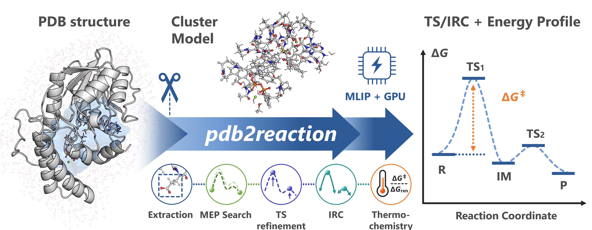

# pdb2reaction Documentation

[GitHub](https://github.com/t-0hmura/pdb2reaction) · [ChemRxiv preprint](https://doi.org/10.26434/chemrxiv.15003538/v1) · [Open in Google Colab](https://colab.research.google.com/github/t-0hmura/pdb2reaction/blob/main/examples/pdb2reaction_colab.ipynb)

*Version: v{{ release }}*

---



**pdb2reaction** is a Python CLI toolkit for exploring candidate enzymatic reaction pathways from PDB structures using machine-learning interatomic potentials (MLIPs).

New to pdb2reaction? Start with [Getting Started](getting-started.md).

```{toctree}
:maxdepth: 2
:caption: Guides
:hidden:

getting-started
installation
quickstart-all
quickstart-scan
quickstart-tsopt
model-setup
mechanism-tips
dft-backend
troubleshooting
```

```{toctree}
:maxdepth: 2
:caption: Commands
:hidden:

all
fix-altloc
add-elem-info
extract
opt
scan
scan2d
scan3d
path-opt
path-search
tsopt
irc
freq
dft
sp
bond-summary
trj2fig
energy-diagram
```

```{toctree}
:maxdepth: 2
:caption: Reference
:hidden:

cli-conventions
reference/commands/index
yaml-reference
json-output
output-layout
backends
hpc-example
mcp_server
glossary
architecture
```

```{toctree}
:maxdepth: 2
:caption: ガイド
:hidden:

ja/index
ja/getting-started
ja/installation
ja/quickstart-all
ja/quickstart-scan
ja/quickstart-tsopt
ja/model-setup
ja/mechanism-tips
ja/dft-backend
ja/troubleshooting
```

```{toctree}
:maxdepth: 2
:caption: コマンド
:hidden:

ja/all
ja/fix-altloc
ja/add-elem-info
ja/extract
ja/opt
ja/scan
ja/scan2d
ja/scan3d
ja/path-opt
ja/path-search
ja/tsopt
ja/irc
ja/freq
ja/dft
ja/sp
ja/bond-summary
ja/trj2fig
ja/energy-diagram
```

```{toctree}
:maxdepth: 2
:caption: リファレンス
:hidden:

ja/cli-conventions
ja/yaml-reference
ja/json-output
ja/output-layout
ja/backends
ja/hpc-example
ja/mcp_server
ja/glossary
ja/architecture
```

## Quick start

| Goal | Page |
|------|------|
| **Run the whole pathway from R and P** | [Quickstart: all](quickstart-all.md) |
| **Start from one structure (no product structure)** | [Quickstart: scan](quickstart-scan.md) |
| **Optimize and check a TS candidate** | [Quickstart: TS-only mode](quickstart-tsopt.md) |
| **Build, trim, or extend the cluster model** | [Building the cluster model](model-setup.md) |
| **Study a mechanism, or the TS search fails** | [Tips for studying reaction mechanisms](mechanism-tips.md) |
| **Check the TS with DFT** | [Refine an MLIP TS with DFT](dft-backend.md) |
| **A run failed** | [Troubleshooting](troubleshooting.md) |

## Subcommands

| Subcommand | Description |
|------------|-------------|
| [`all`](all.md) | Optional extraction; one of the three [input modes](getting-started.md#choosing-an-input-mode) (multi-structure MEP search, single structure + scan, TS-only mode); optional TS/IRC, thermochemistry, and DFT stages |
| [`extract`](extract.md) | Extract active site model (binding pocket) from protein–ligand complex |
| [`fix-altloc`](fix-altloc.md) | Resolve PDB alternate locations |
| [`add-elem-info`](add-elem-info.md) | Repair PDB element columns (77–78) |
| [`opt`](opt.md) | Single-structure geometry optimization (L-BFGS or RFO; optional `--flatten` removes leftover imaginary modes) |
| [`tsopt`](tsopt.md) | Transition state optimization (Dimer or RS-P-RFO; optional `--flatten` removes extra imaginary modes) |
| [`path-opt`](path-opt.md) | Single-step MEP optimization via GSM or DMF (from 2 structures) |
| [`path-search`](path-search.md) | Recursive multi-step MEP search with automatic refinement (2+ structures) |
| [`scan`](scan.md) | Restrained distance scan supporting concerted multi-distance and multistage scans |
| [`scan2d`](scan2d.md) | Two-dimensional energy-landscape exploration and PES mapping |
| [`scan3d`](scan3d.md) | Three-dimensional energy-landscape exploration and PES mapping |
| [`freq`](freq.md) | Vibrational frequency analysis & thermochemistry |
| [`irc`](irc.md) | Intrinsic Reaction Coordinate calculation |
| [`dft`](dft.md) | Single-point DFT calculations (GPU4PySCF / PySCF) |
| [`sp`](sp.md) | Single-point calculator energy + forces / Hessian (MLIP or `-b dft`) |
| [`trj2fig`](trj2fig.md) | Plot energy profiles from XYZ trajectories |
| [`energy-diagram`](energy-diagram.md) | Draw an energy diagram from numeric values |
| [`bond-summary`](bond-summary.md) | Detect and report covalent bond changes between consecutive structures |

## Configuration and reference

| Topic | Page |
|-------|------|
| **Common options and input requirements** | [Common options and selectors](cli-conventions.md) |
| **Frozen atoms and distance restraints (`--freeze-atoms`, `--distance-restraint`)** | {ref}`Freeze atoms and restrain distances <freeze-atoms-and-restraints>` |
| **Common errors and fixes** | [Troubleshooting](troubleshooting.md) |
| **CLI command reference** | [Command Reference](reference/commands/index.md) |
| **YAML configuration options** | [YAML Reference](yaml-reference.md) |
| **MLIP backend settings** | [MLIP Backends](backends.md) |
| **Files each command writes** | [Output Directory Layout](output-layout.md) |
| **Keys of `result.json` and `summary.json`** | [JSON Output Reference](json-output.md) |
| **Running on several GPU nodes (PBS + Ray)** | [HPC example](hpc-example.md) |
| **Calling pdb2reaction from an AI agent (MCP)** | [MCP server](mcp_server.md) |
| **Code structure (for developers)** | [Architecture](architecture.md) |
| **Terminology** | [Glossary](glossary.md) |

## System requirements

### Hardware

- **OS:** Linux.
- **GPU (recommended):** an NVIDIA driver compatible with the backend and PyTorch wheel. CPU execution is also supported but slower.
- **VRAM / RAM:** depends on the model, the system size, and the Hessian mode; measure the peak on a representative run.

### Software

- Python >= 3.11.
- CPU or CUDA-enabled PyTorch. Prebuilt wheels include their CUDA runtime; a local toolkit is normally needed only for source builds.

See [Installation](installation.md) for setup.

## Agent skills

`skills/` contains guides for CLI commands, structure I/O, backends, workflows, output analysis, and HPC use.
See the [Skills index](https://github.com/t-0hmura/pdb2reaction/blob/main/skills/README.md) for installation and the full list.

## Citation

```bibtex
@misc{ohmura2026pdb2reaction,
  author = {Ohmura, Takuto and Sato, Hajime and Terada, Tohru},
  title  = {pdb2reaction: End-to-End Reaction-Path Elucidation from PDB Structures Using Machine-Learning Interatomic Potentials},
  year   = {2026}, doi = {10.26434/chemrxiv.15003538/v1}, note = {ChemRxiv preprint}
}
```

To cite the software or a specific release, use the Zenodo record:

```bibtex
@software{ohmura2026pdb2reaction_software,
  author       = {Ohmura, Takuto},
  title        = {pdb2reaction},
  year         = {2026},
  version      = {0.5.0},
  url          = {https://github.com/t-0hmura/pdb2reaction},
  license      = {GPL-3.0},
  doi          = {10.5281/zenodo.19197865}
}
```

## License

GNU General Public License v3 (GPL-3.0).

## Getting Help

```bash
# General help
pdb2reaction --help

# Command help
pdb2reaction <subcommand> --help

# Advanced options (dry-run, internal tuning, etc.)
pdb2reaction <subcommand> --help-advanced
```

Report problems and feature requests on [GitHub Issues](https://github.com/t-0hmura/pdb2reaction/issues).
