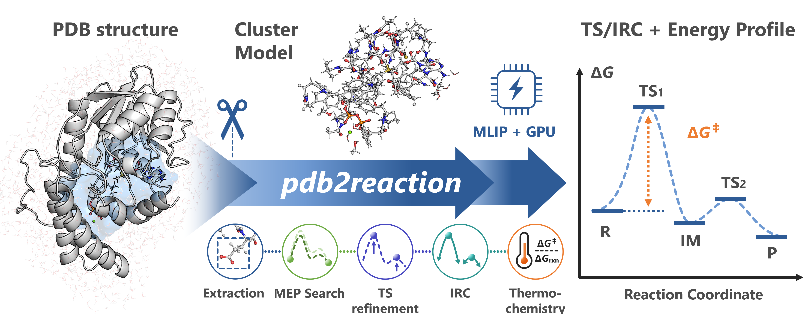

# はじめに

## 概要



`pdb2reaction` は、機械学習原子間ポテンシャル（MLIP: Machine Learning Interatomic Potential）を用いて **PDB 構造から酵素反応経路をモデリング** する Python 製の CLI ツールキットです。

多くのケースで、次のような **1 コマンド** から反応経路の初期案を得られます。
```bash
pdb2reaction -i 1.R.pdb 3.P.pdb -c 'SAM,GPP,MG' -l 'SAM:1,GPP:-3'
```

---
さらに `--tsopt --thermo --dft` を追加すると、**最小エネルギー経路（MEP: Minimum Energy Path）探索 → 遷移状態（TS: Transition State）最適化 → 固有反応座標（IRC: Intrinsic Reaction Coordinate） → 振動解析・熱化学 → DFT 一点計算** までまとめて実行できます。
```bash
pdb2reaction -i 1.R.pdb 3.P.pdb -c 'SAM,GPP,MG' -l 'SAM:1,GPP:-3' --tsopt --thermo --dft
```
---

> **実行例:** [`examples/`](https://github.com/t-0hmura/pdb2reaction/tree/main/examples) ディレクトリに GPP C6-メチル基転移酵素 BezA（[Tsutsumi et al., *Angew. Chem. Int. Ed.* 2022, 61, e202111217](https://doi.org/10.1002/anie.202111217)）の完全な `all` ワークフロースクリプト（MEP およびスキャンパイプライン）があります。

入力として、(i) 反応順に並べたタンパク質–リガンド複合体の PDB を 2 つ以上（R → … → P）、(ii) `--scan-lists/-s` を指定した 1 つの PDB、または (iii) TS 候補 1 構造 + `--tsopt` を与えると、`pdb2reaction` が次を自動化します。

- ユーザーが指定した基質の周辺から **活性部位モデル（バインディングポケット）** を切り出し、計算用の **クラスターモデル**（Cluster Model）を構築
- Growing String Method (GSM) や Direct Max Flux (DMF) などの経路最適化手法で **最小エネルギー経路 (MEP: Minimum Energy Path)** を探索
- 必要に応じて **遷移状態（TS: Transition State）** を最適化し、**IRC（固有反応座標: Intrinsic Reaction Coordinate）計算**・**振動解析**・**DFT 一点計算** を実行

ポテンシャルエネルギー面（PES: Potential Energy Surface）の計算には機械学習原子間ポテンシャル（MLIP）を用います。デフォルトのバックエンドは Meta の **UMA** ですが、`-b/--backend` により **ORB**、**MACE**、**AIMNet2**も選択できます。想定される主な用途は以下の通りです。

- DFT 等の量子化学計算では検証に時間がかかる規模の**反応機構解析の試行錯誤**
- 量子化学計算に向けた**初期構造の作成**（反応物・TS・生成物のクラスターモデル）
- 基質バリアントや酵素変異体にわたる**反応経路の大量計算**

抽出を行わない全系ワークフロー（`--center/-c` と `--ligand-charge/-l` を省略）では `.xyz` / `.gjf` 入力も利用できます。小分子系にもそのまま適用可能です。

**HPC クラスターやマルチ GPU 環境**では、UMA 推論をノード間で並列化することで、大規模なクラスターモデル（必要なら **完全なタンパク質–リガンド複合体**）にも対応できます。`workers` と `workers_per_node` で並列度を設定してください（詳細は [MLIP バックエンド](uma-pysis.md)）。`-b/--backend` により代替バックエンド（ORB、MACE、AIMNet2）を選択することもできます。

### パイプライン概要

`all` サブコマンドは以下のステージを自動実行します:

```text
PDB (R, P)
  |
  v
[extract]  活性部位モデル抽出（クラスターモデル）
  |
  v
[scan]  （オプション, --scan-lists/-s）段階的距離拘束スキャン
  |
  v
[path-search]  MEP 探索（再帰的 path-search、デフォルト; `--refine-path False` で path-opt に切替）
  |
  v
[tsopt]  TS 最適化 (RS-I-RFO; 代替として Dimer)
  |
  v
[irc]  固有反応座標
  |
  v
[freq]  振動解析 + 熱化学 (R, TS, P)
  |
  v
[dft]  一点 DFT エネルギー（オプション, --dft）
```

各ステージは単独のサブコマンドとしても実行できます。`all` はこれらを統合し、`summary.json` と `summary.log` を出力します。

### 主要な出力ファイル

| ファイル | 説明 |
|---------|------|
| `summary.json` | 機械可読な結果（障壁、エネルギー、結合変化、環境情報） |
| `summary.log` | ディレクトリツリー付きテキストサマリ |
| `seg_XX/` | 反応ステップごとの IRC 最適化 R/TS/P 構造 |
| `mep.pdb` | PyMOL/VMD で表示可能な MEP 軌跡 |
| `energy_diagram_*.png` | エネルギープロファイル図（電子/Gibbs 補正） |

```{important}
- 入力 PDB ファイルには**水素原子**が含まれている必要があります。
- 複数の PDB を提供する場合、**同じ原子が同じ順序**で含まれている必要があります（座標のみが異なる状態）。一致しない場合はエラーになります。
```

```{tip}
症状から切り分ける場合は、まず [典型エラー別レシピ](recipes-common-errors.md) を参照してください。
セットアップや実行でエラーに遭遇したら [トラブルシューティング](troubleshooting.md) も参照してください。
```

### CLI の規約

| 規約 | 例 | 備考 |
|-----|-----|------|
| **残基セレクタ** | `'SAM,GPP'`, `'A:123,B:456'` | 複数値はシェル展開防止のためクォート |
| **電荷マッピング** | `-l 'SAM:1,GPP:-3'` | コロンで名前と電荷を区切り、カンマでエントリを区切る |
| **原子セレクタ** | `'TYR,285,CA'` または `'TYR 285 CA'` | 区切り文字: 空白、カンマ、スラッシュ、バッククォート、バックスラッシュ |

詳細は [CLI 規約](cli-conventions.md) を参照してください。

### 水素原子付与の推奨ツール

PDB に水素原子がない場合は、pdb2reaction を実行する前に次のいずれかを使ってください。

| ツール | コマンド例 | 備考 |
|--------|------------|------|
| **reduce** (Richardson Lab) | `reduce input.pdb > output.pdb` | 高速、結晶構造に広く使用 |
| **pdb2pqr** | `pdb2pqr --ff=AMBER input.pdb output.pqr` | 水素を追加し部分電荷を割り当て |
| **Open Babel** | `obabel input.pdb -O output.pdb -h` | 汎用化学情報処理ツールキット |
| **PyMOL** | `h_add`（PyMOL 内） | 分子可視化ツール（水素付加機能あり） |
| **tleap** (AmberTools) | `tleap -f leapin` | Amber 力場準備ツール |

複数の PDB 入力で同一の原子順序を確保するには、すべての構造に同じ水素付与ツールを一貫した設定で適用してください。

---

## 推奨クイックスタート導線

セットアップと依存関係の詳細は [インストール](installation.md) を参照してください。

- [クイックスタート: `pdb2reaction all`](quickstart-all.md)
- [クイックスタート: `pdb2reaction all --scan-lists/-s` で単一構造の段階的スキャン+MEP+TS](quickstart-scan.md)
- [クイックスタート: `pdb2reaction tsopt`（TS 最適化と検証）](quickstart-tsopt-freq.md)

---

## コマンドの基本構成

`pip` でインストールされる `pdb2reaction` コマンドが主な起点です。短縮エイリアス **`p2r`** も `pdb2reaction` パッケージが同じ setuptools entry point で登録しており（`pip install pdb2reaction` 直後から両方利用可能）、すべてのコマンドをどちらの名前でも実行できます。内部的には **Click** ライブラリを使用しており、デフォルトのサブコマンドは `all` です。

つまり:

```bash
pdb2reaction [OPTIONS]...
# は以下と同等
pdb2reaction all [OPTIONS]...
```

`all` は、クラスター抽出から MEP 探索、TS 最適化、IRC、振動解析、DFT 一点計算までを 1 コマンドで一括実行するサブコマンドです。

クラスター抽出を行う場合、ワークフロー全体で共通の重要オプションが 2 つあります:

- `-i/--input`: 1つ以上の**完全構造**（反応物、中間体、生成物）
- `-c/--center`: **基質/抽出中心**の定義方法（例: 残基名または残基ID）

`--center/-c` を省略すると、クラスター抽出はスキップされ、**完全な入力構造**が直接使用されます。

---

## 主要なワークフロー

### 複数構造MEPワークフロー（反応物 → 生成物）

推定反応座標に沿った複数の完全な PDB 構造（例: R → I1 → I2 → P）がすでにある場合に使用します。

**最小例**

```bash
pdb2reaction -i 1.R.pdb 3.P.pdb -c 'SAM,GPP,MG' -l 'SAM:1,GPP:-3'
```

**詳細例**

```bash
pdb2reaction -i 1.R.pdb 3.P.pdb -c 'SAM,GPP,MG' -l 'SAM:1,GPP:-3' \
 --out-dir ./result_all --tsopt --thermo --dft
```

処理の流れ:

- 反応順に並んだ 2 つ以上の**完全系**を受け取る
- 各構造から触媒クラスターモデルを抽出
- デフォルトで**再帰的** `path-search` による **MEP 探索**を実行（出力は `path_search/`）
- `--refine-path False` を指定すると単一パス `path-opt` に切り替え（出力は `path_opt/`）
- PDB テンプレートがある場合、クラスターモデル MEP を**完全系**にマージ
- 必要に応じて各セグメントで TS 最適化、IRC、振動解析、DFT 一点計算を実行

ドッキング、MD、手動モデリングなどで中間体を準備できる場合に推奨するモードです。

---

### 単一構造 + 段階的スキャン（MEP 精密化への入力）

**1 つの PDB 構造**しかないが、反応に沿ってどの原子間距離が変化するかが分かっている場合に使用します。

`--scan-lists/-s` と一緒に単一の `-i` を指定します:

**最小例**

```bash
pdb2reaction -i 1.R.pdb -c 'SAM,GPP,MG' -l 'SAM:1,GPP:-3' \
 -s '[("CS1 SAM 320","GPP 321 C7",1.60)]' \
 '[("GPP 321 H11","GLU 186 OE2",0.90)]'
```

**詳細例**

```bash
pdb2reaction -i 1.R.pdb -c 'SAM,GPP,MG' -l 'SAM:1,GPP:-3' \
 -s '[("CS1 SAM 320","GPP 321 C7",1.60)]' \
 '[("GPP 321 H11","GLU 186 OE2",0.90)]' \
 --multiplicity 1 --out-dir ./result_scan --tsopt --thermo --dft
```

補足:

- `--scan-lists/-s` は抽出されたクラスターモデルでの**段階的距離スキャン**を記述
- 各タプル `(i, j, target_Å)` は:
 - `'TYR,285,CA'` のようなPDB原子セレクター文字列（**区切り文字**: スペース/カンマ/スラッシュ/バッククォート/バックスラッシュ ` ` `,` `/` `` ` `` `\`）**または**1始まりの原子インデックス
 - クラスターモデルのインデックスに自動的に再マッピング
- 1 つの `--scan-lists/-s` リテラルで 1 ステージを実行。複数リテラルを渡すと順次ステージとして実行されます（例: `-s '[(…)]' '[(…)]'`）
- 各ステージは `stage_XX/result.pdb` を書き出し、候補中間体または生成物として扱われる
- デフォルトの `all` ワークフローは再帰的 `path-search` による自動精密化で処理（PDB テンプレートがある場合はマージされた `mep_w_ref*.pdb` を生成）
- `--refine-path False` を指定すると、連結されたステージを単一パス `path-opt` で処理

このモードは単一構造から反応経路を構築するのに便利です。

---

### 単一構造 TSOPT のみモード

すでに**遷移状態候補**があり、それを最適化して IRC 計算を行いたい場合に使用します。

PDB を 1 つだけ指定し、`--tsopt` を有効にします:

**最小例**

```bash
pdb2reaction -i TS_CANDIDATE.pdb -c 'SAM,GPP' -l 'SAM:1,GPP:-3' --tsopt
```

**詳細例**

```bash
pdb2reaction -i TS_CANDIDATE.pdb -c 'SAM,GPP' -l 'SAM:1,GPP:-3' \
 --tsopt --thermo --dft --out-dir ./result_tsopt_only
```

処理の流れ:

- MEP/経路探索は実行しません。
- TS 最適化で**クラスターモデル上の TS** を収束させます。
- 両方向で **IRC** を実行し、両端点を最適化して R および P 極小に緩和します。
- R/TS/P に対して `freq` と `dft` を実行できます。
- MLIP、Gibbs、DFT//MLIP（MLIP 最適化構造での DFT 一点エネルギー）エネルギーダイアグラムを生成します。

`energy_diagram_*_all.png` や `irc_plot_all.png` などの出力は、トップレベルの `--out-dir` の下にもコピーされます。

```{important}
単一入力実行には **`--scan-lists/-s`**（段階的スキャン → GSM）**または** `--tsopt`（TSOPT のみ）のいずれかが必要です。これらのいずれも指定せずに単一の `-i` のみを渡しても、ワークフローは実行されません。
```

---

## 重要な CLI オプションと動作

以下はワークフロー全体で最もよく使用されるオプションです。

| オプション | 説明 |
|----------|------|
| `-i, --input PATH...` | 入力構造。**2 つ以上の PDB** → MEP 探索; **1 つの PDB + `--scan-lists/-s`** → 段階的スキャン → GSM; **1 つの PDB + `--tsopt`** → TSOPT のみモード |
| `-c, --center TEXT` | 基質/抽出中心を定義。残基名（`'SAM,GPP'`）、残基ID（`A:123,B:456`）、または PDB パスをサポート |
| `-l, --ligand-charge TEXT` | 電荷情報: マッピング（`'SAM:1,GPP:-3'`）または単一整数 |
| `-q, --charge INT` | 総電荷の強制上書き |
| `-m, --multiplicity INT` | スピン多重度（例: 一重項は `1`）。 |
| `-s, --scan-lists TEXT...` | 単一入力実行用の段階的距離スキャン |
| `-o, --out-dir PATH` | トップレベル出力ディレクトリ |
| `--tsopt/--no-tsopt` | TS 最適化と IRC を有効化 |
| `--thermo/--no-thermo` | 振動解析と熱化学を実行 |
| `--dft/--no-dft` | DFT 一点計算を実行 |
| `--refine-path/--no-refine-path` | 再帰的 `path-search` を使用（デフォルト: `True`）。`False` で単一パス `path-opt` に切替 |
| `--opt-mode grad\|hess` | `all` でのワークフロープリセット（`grad` -> LBFGS/Dimer、`hess` -> RFO/RS-I-RFO。**`all` の pre-opt スコープではデフォルト `grad`**）。コマンド個別実行では `opt --opt-mode grad|hess`、`tsopt --opt-mode grad|hess` を推奨。**スコープによりデフォルトが異なる**: 単独の `tsopt --opt-mode` のデフォルトは `hess`。サブコマンドごとの完全なマッピングは {ref}`ja-opt-mode-semantics` を参照 |
| `--opt-mode-post grad\|hess` | `all` 専用の TSOPT / post-IRC 端点最適化向けオーバーライド（デフォルト: `hess`）。未指定時は `--opt-mode` を明示した場合のみそれに追従し、それ以外は `hess` にフォールバック |
| `--mep-mode gsm\|dmf` | MEP 手法（デフォルト: `gsm`）: Growing String Method または Direct Max Flux |
| `--hessian-calc-mode Analytical\|FiniteDifference` | ヘシアン行列の計算モード（デフォルト: `FiniteDifference`）。詳細は {ref}`MLIP 計算機 <ja-hessian-evaluation>` を参照 |

すべてのオプションと YAML スキーマについては [all](all.md) および [YAML リファレンス](yaml-reference.md) を参照してください。

---

## サマリーファイル

`pdb2reaction all` を実行すると、以下のサマリーファイルが出力されます。

- `summary.log` – 結果要約
- `summary.json` – JSON 結果

主な記載内容:

- 実行した CLI コマンド
- MEP 全体の統計（最大障壁、経路長など）
- セグメントごとの障壁高さと主要な結合変化
- MLIP バックエンド、熱化学、DFT 後処理で得られたエネルギー（有効な場合）

`path_search/`（`--refine-path False` 使用時は `path_opt/`）配下の各セグメントディレクトリにも `summary.log` と `summary.json` があり、個別のセグメントの精密化結果を確認できます。

---

## CLI サブコマンド

ほとんどのユーザは `pdb2reaction all` を主に使います。CLI は個別サブコマンドも提供しており、各コマンドは `-h/--help` に対応しています（計算/スキャン/抽出/ユーティリティ系は `--help-advanced` で全オプションを表示）。カテゴリ別のサブコマンド一覧と各ドキュメントへのリンクは [ドキュメントトップ](index.md#cli-サブコマンド) を参照してください。

---

## ヘルプ

任意のサブコマンドについて:

```bash
pdb2reaction <subcommand> --help
pdb2reaction <subcommand> --help-advanced
pdb2reaction all --help-advanced
```

MLIP バックエンドの詳細オプションについては [MLIP バックエンド](uma-pysis.md) を参照してください。

問題が発生した場合は、[GitHubリポジトリ](https://github.com/t-0hmura/pdb2reaction) でIssueを開いてください。
