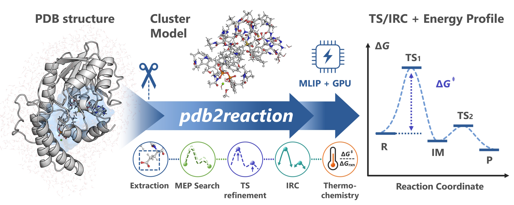

# はじめに

::::{container} p2r-intro


:::{container} p2r-intro-text
`pdb2reaction` は、機械学習原子間ポテンシャル（MLIP）を活用し、**PDB / mmCIF 構造から酵素の反応経路候補を自動探索する** Python 製 CLI ツールキットです。

MLIP は、DFT（密度汎関数法）の計算データを学習したニューラルネットワークです。DFT に近い精度のエネルギーと力を、ずっと少ない計算コストで求められるので、反応経路の探索を速く進められます。

多くのケースでは、次のような **1 コマンド** で反応経路の初期案を得られます。

```bash
pdb2reaction -i 1.R.pdb 3.P.pdb -c 'SAM,GPP,MG' -l 'SAM:1,GPP:-3'
```

小分子の反応にも使えます。`-c` を付けなければ入力の構造をそのまま計算し、全体の電荷は `-q` で指定します（[小分子の反応機構解析](small-molecules.md)）。

```bash
pdb2reaction -i R.xyz P.xyz -q +1
```
:::
::::

このページでは、酵素の反応機構を調べる流れに沿って、計算化学の基本と `pdb2reaction` の使い方を説明します。

> **実行例:** [`examples/`](https://github.com/t-0hmura/pdb2reaction/tree/main/examples) ディレクトリに、上のコマンドで使う構造（`1.R.pdb`、`3.P.pdb`）と、GPP C6-メチル基転移酵素 BezA（[Tsutsumi et al., *Angew. Chem. Int. Ed.* 2022, 61, e202111217](https://doi.org/10.1002/anie.202111217)）を題材とした一連のワークフロースクリプト（MEP 探索とスキャン）を用意しています。[インストール](installation.md)の後、`git clone https://github.com/t-0hmura/pdb2reaction && cd pdb2reaction/examples` で取得し、その中で上のコマンドを実行してください。

---

## 全体の流れ

酵素の反応機構は、次の 7 つの手順で調べます。手順 2〜6 は、`pdb2reaction` の 1 つのコマンドで続けて実行できます。

| 手順 | 使うもの | `pdb2reaction` での扱い |
| --- | --- | --- |
| 1. 複合体の構造を用意する | 構造予測・ドッキング → MD | `pdb2reaction` の外 |
| 2. クラスターモデルを切り出す | `extract` | `-c` のとき |
| 3. 反応経路を探す | `scan`・`path-opt`・`path-search` | `scan` は `-s` のとき、経路探索は TS-only モード以外 |
| 4. TS を最適化し、虚振動を確かめる | `tsopt` | `--tsopt` のとき |
| 5. R と P につながるかを確かめる | `irc` | `--tsopt` のとき |
| 6. エネルギーを比べる | `freq`・`dft` | `--tsopt` に `--thermo`・`--dft` を足したとき |
| 7. 総合的に判断する | NAC の割合、障壁の最小値・中央値 | 複数のスナップショットで |

手順 2〜6 をすべて行うコマンドは次のとおりです。

```bash
pdb2reaction -i 1.R.pdb 3.P.pdb -c 'SAM,GPP,MG' -l 'SAM:1,GPP:-3' --tsopt --thermo --dft
```

各手順は [`extract`](extract.md)、[`tsopt`](tsopt.md)、[`irc`](irc.md) などのサブコマンドとして単独でも実行できます。一覧は [サブコマンド](index.md#サブコマンド) にあります。

---

## 1. 複合体の構造を用意する

AlphaFold 3、Boltz-2、OpenFold3 などの構造予測や、各種のドッキングツールで、酵素と基質の複合体の構造を作ります。それを分子動力学（MD）計算にかけ、さまざまな配座のスナップショットを取り出します。1 つの構造だけで結論を出さず、複数のスナップショットで計算するのが基本です。

`pdb2reaction` に渡す構造には、次の 2 点が必要です。

### 水素原子を付ける（必須）

入力構造には**すべての水素原子が含まれている必要があります**。結晶構造など水素が欠落している構造を使用する場合は、事前に以下のツール等で付加してください。

| 推奨ツール | コマンド例 | 特徴 |
| --- | --- | --- |
| **reduce** (Richardson Lab) | `reduce input.pdb > output.pdb` | 高速で結晶構造の水素付加に広く使われる |
| **Open Babel** | `obabel input.pdb -O output.pdb -h` | 汎用的な化学情報処理ツール |
| **PyMOL** | コマンドラインで `h_add` | ビジュアルを確認しながら付加可能 |
| **tleap** (AmberTools) | `tleap -f leapin` | Amber 力場に基づく精密な付加 |

`all` は空の元素欄（77–78 列）を自分で埋めます。`extract` などのコマンドを単独で使う前には、[`add-elem-info`](add-elem-info.md) で埋めてください。代替位置（altLoc）は、どのコマンドも PDB を読むときに残基ごとに {ref}`平均占有率の最も高いもの <ja-mmcif-input>` を 1 つ選びます。選んだ結果をファイルに残すには [`fix-altloc`](fix-altloc.md) を使います。

### 原子の並び順をそろえる（複数構造のとき）

反応物（R）や生成物（P）など複数の構造を入力する場合、**すべての構造で同一の原子が同じ順序で並んでいる必要があります**（座標値のみが異なる状態）。水素付加ツールを用いる際は、すべての構造に対して同一の設定で処理してください。反応で別の残基に移る原子も、R での残基名と原子名のままにします。同梱例では、GPP から Glu186 に移る水素は `3.P.pdb` でも `GPP 321` の `H11` です。

mmCIF（`.cif`・`.mmcif`）と、残基が 10,000 以上や原子が 99,999 以上の大きな構造も、PDB と同じコマンドで扱えます。詳しくは {ref}`mmCIF の入力 <ja-mmcif-input>` を参照してください。

---

## 2. クラスターモデルを切り出す

酵素は数千〜数万原子あり、全体を DFT で計算するのは現実的ではありません。そこで、反応に関わる基質・補因子と、その周りの残基だけを切り出して計算します。これを**クラスターモデル**と呼びます。

- 切った共有結合は、水素でふさぎます（キャップ水素）。
- キャップ水素の付いた原子は固定して、タンパク質の中での形を保ちます。

`pdb2reaction` は、`-c` で指定した基質から `-r`（デフォルト 2.6 Å）以内に原子がある残基を選び、このモデルを自動で作ります。`-c` を省くと、切り出さずに入力構造をそのまま使います。詳しくは [クラスターモデルの組み方](model-setup.md) を参照してください。

**モデルの大きさ**：大きくするほど結果は安定しますが、計算は重くなります。COMT（カテコール *O*-メチル基転移酵素）では、QM/MM の QM 領域を基質から近い順に広げると、約 500〜600 原子で活性化エネルギーがほぼ一定になりました（[Kulik et al., *J. Phys. Chem. B* 2016, 120, 11381](https://doi.org/10.1021/acs.jpcb.6b07814)）。`pdb2reaction` の論文でも、同じ COMT のクラスターモデルを `-r 4.0`（670 原子）以上にすると、全系（3420 原子）と同じ反応機構が得られ、障壁も全系との差が 4 kcal/mol 以内でした（[Ohmura et al., *ACS Omega* 2026](https://doi.org/10.1021/acsomega.6c08242)）。`pdb2reaction` は計算コストを考えて `-r 2.6` をデフォルトにしています。デフォルトの有限差分の Hessian なら、`-r 4.0` に広げても VRAM 16 GB の GPU で十分に計算できるので、`-r 4.0` にするのもおすすめです。同梱例の BezA では、`-r 2.6` で 632 原子、`-r 4.0` で 859 原子のモデルになり、VRAM 24 GB の GPU で測った振動数計算 1 回は、VRAM の最大が約 5 GB と約 7 GB、時間が約 24 分と約 37 分でした。

---

## 3. 反応経路を探す

反応物（R）と生成物（P）の構造を最適化し、R と P をつなぐ最小エネルギー経路（MEP）を探します。経路のなかで最もエネルギーの高い点が、遷移状態（TS）の候補になります。小分子でも、この手順は同じです（[小分子の反応](small-molecules.md)）。

入力の与え方は 3 通りです。

| 実行モード | 入力条件 | 主な動作 |
| --- | --- | --- |
| **Endpoint モード** | 2 つ以上の PDB（`-i R.pdb P.pdb`） | 各構造から同じクラスターモデルを切り出し（`-c` のとき）、その間の MEP を探索 |
| **Scan-list モード** | 1 つの PDB ＋ `--scan-lists`（`-s`） | 指定結合の距離を段階的に変化させて経路を生成 |
| **TS-only モード** | 1 つの PDB ＋ `--tsopt` | MEP 探索をスキップし、TS 候補の最適化・IRC を直接実行 |

> **注意:** 単一構造を入力するときは、`--scan-lists/-s` か `--tsopt` が必要です。どちらも無いとエラーになります。

---

## 4. TS を最適化し、虚振動を確かめる

TS は、反応の進む方向にだけエネルギーが極大で、ほかのすべての方向には極小になっている点（一次の鞍点）です。この点で振動数を計算すると、反応の進む方向の 1 つだけが虚数の振動数（虚振動）になります。虚振動が 0 なら極小、2 つ以上なら TS ではありません。

TS 最適化が成功すると、反応モードの虚振動が 1 つ出ます。その虚振動が、狙った結合の組み換えの動きになっていることも確かめてください。

**固定した原子と PHVA**：クラスターモデルでは、固定した原子を動かす方向について、エネルギーは極小にも鞍点にもなっていません。全原子で振動数を計算すると、固定の影響で本来は無い虚振動が出ることがあります。そこで、動ける原子だけの Hessian（エネルギーの 2 階微分）で振動数を求めます。これを部分 Hessian 振動解析（PHVA）と呼び、`pdb2reaction` は固定した原子があると自動で行います。

---

## 5. R と P につながるかを確かめる

虚振動が 1 つでも、その TS が狙った R と P の間にあるとは限りません。IRC（固有反応座標）で TS から両側へ坂を下り、たどり着いた先が狙った R と P であることを確かめます。`pdb2reaction` は IRC の両端をさらに最適化するので、IRC が途中で止まっても、端点の最適化で狙った R と P に着けば、その結果は使えます。

---

## 6. エネルギーを比べる

`--thermo` で振動解析から熱化学補正（ギブズ自由エネルギー）を、`--dft` で DFT の一点計算を加え、活性化エネルギー（R → TS）と反応エネルギー（R → P）を求めます。

実行が終わると、`-o` の出力ディレクトリに次のファイルができます。デフォルトは `./result_all/` です。主なファイルは [出力ディレクトリのレイアウト](output-layout.md)、`summary.json` のすべての欄は {ref}`JSON 出力の一覧 <ja-summary-json-path-search-all>` にあります。

| 出力ファイル / フォルダ | 内容 |
| --- | --- |
| `summary.log` | テキスト形式のサマリー（ディレクトリ構成、各段階の進行状況） |
| `summary.json` | 機械可読形式の結果（反応障壁、各状態のエネルギー、結合変化） |
| `energy_diagram_*.png` | 生成されたエネルギープロファイル図（電子エネルギー / ギブズ自由エネルギー） |
| `mep_trj.pdb` / `mep_trj.cif` | 最小エネルギー経路（MEP）のアニメーション軌跡ファイル |
| `segments/seg_NN/` | 反応セグメントごとの詳細結果（最適化された R/TS/P 構造、IRC 軌跡など。`--tsopt` のとき） |

端末の出力の最後のほうにある `====== Pipeline summary ======` の下の `Scientific status:` の行は、`summary.json` の `scientific_status` と同じ値です。指定した段がすべて収束すると `success` になり、`--tsopt` のときは TS の n_imag が 1 であることも条件です。そうでなければ `partial` か `failed` になり、理由は `scientific_status_reasons` に出ます。虚振動のモードが狙った結合を動かしているかは各クイックスタートにあるモードのファイルで、IRC の両端が狙った R と P かは `segments[].bond_changes` で、自分で確かめてください。

---

## 7. 総合的に判断する

1 つの経路だけで結論は出せません。MD で反応しやすい配置（反応する原子どうしが近く、反応しやすい向きにある配置。near-attack conformation、NAC）が現れる割合や、複数のスナップショットで得られた反応障壁の最小値・中央値などをあわせて見て、反応機構が妥当かを検討します。

結果は、初期構造とモデルの組み方に大きく左右されます。構造やモデルを変えて何度も計算し直す試行錯誤はどうしても必要です。`pdb2reaction` は手順 2〜6 を自動化し、MLIP で速く計算するので、この試行錯誤に向いています。

---

## その先へ

`pdb2reaction` の強みは、多くの基質や変異体をまとめて計算するハイスループット計算、実験値の裏付け、試行錯誤に使えることです。

MLIP で全系を扱う MD や ML/MM MD を行うと、酵素全体のダイナミクスも見られます。ただし、これらの MD は、ポテンシャルエネルギー面の上でのクラスターモデルや ML/MM の計算より計算コストが高いので、`pdb2reaction` で反応機構を確かめてから行うのもよい方法です。

MLIP は比較的新しい技術なので、計算だけで論文を書くときは、しばらくは DFT の計算が求められると思います。`pdb2reaction` は DFT のバックエンドも備えているので、MLIP で見つけた TS を DFT で確かめる QM 計算まで、同じツールの中で完結できます（[MLIP の TS を DFT で確かめる](dft-backend.md)）。ぜひ使ってみてください。

---

## クイックスタート導線

環境構築の詳細は [インストールガイド](installation.md) を参照してください。

* **Web ブラウザで手軽に試す**: [Colab GUI ノートブック](https://colab.research.google.com/github/t-0hmura/pdb2reaction/blob/main/examples/pdb2reaction_colab.ipynb)（3D プレビューで残基を選択）
* **複数の PDB 構造から始める**: [クイックスタート: `pdb2reaction all`](quickstart-all.md)
* **1 つの PDB 構造からスキャンで探索する**: [クイックスタート: `pdb2reaction all --scan-lists`](quickstart-scan.md)
* **TS 候補構造を最適化・検証する**: [クイックスタート: TS-only モード](quickstart-tsopt.md)

---

## コマンドの基本構成

インストール後は `pdb2reaction` および短縮コマンド `p2r` が利用できます。サブコマンドを省略した場合、自動的に `all` が呼び出されます。

```bash
# 以下の 2 つは同一の処理を行います
pdb2reaction [OPTIONS]...
pdb2reaction all [OPTIONS]...
```

---

## 基本的な CLI オプション

| オプション | 引数の例 | 説明 |
| --- | --- | --- |
| `-i, --input` | `1.R.pdb 3.P.pdb` | 入力構造ファイル（PDB / mmCIF）。複数指定可能 |
| `-c, --center` | `'SAM,GPP'` / `'A:SAM:123'` | 抽出中心（基質残基名・残基 ID・入力と同じ座標の基質だけを入れた PDB ファイル）。省略時は切り出しを行わず構造全体を使用 |
| `-l, --ligand-charge` | `'SAM:1,GPP:-3'` | リガンドごとの形式電荷マッピング（標準残基とイオンの電荷は自動で数えます） |
| `-q, --charge` | `-2` | 抽出モデル全体の総電荷（自動判定を上書きする場合に指定） |
| `-m, --multiplicity` | `1` | スピン多重度（デフォルト: `1`、一重項） |
| `--tsopt/--no-tsopt` | （フラグ） | TS 最適化と IRC 計算を有効化 |
| `--thermo/--no-thermo` | （フラグ） | 振動解析と QRRHO（準剛体ローター・調和振動子）モデルによる熱化学補正を実行（`--tsopt` と併用） |
| `--dft/--no-dft` | （フラグ） | 得られた構造に対して一点 DFT 計算を実行（`--tsopt` と併用） |
| `-b, --backend` | `uma` / `orb` / `mace` | 使用する MLIP バックエンドを指定（デフォルト: `uma`） |

`--dft` には、{ref}`詳細なインストール手順 <ja-step-by-step-installation>` の手順 7 で入れる DFT 用の追加パッケージが要ります。

構文ルールの詳細は [共通オプションと残基・原子の指定](cli-conventions.md)、全オプションは [`all` のオプションの一覧（英語のみ）](../reference/commands/all.md) を参照してください。

---

## AI エージェント連携（Skills）

`pdb2reaction` には、AI エージェント（Claude Code、Codex、Cursor など）向けの手順書が `skills/` ディレクトリに同梱されています。導入するときは、AI エージェントに次のように指示してください。

> `https://github.com/t-0hmura/pdb2reaction/tree/main/skills` をスキルとして取り込み、`pdb2reaction-install` の手順に従って pdb2reaction をインストールして

GitHub のリポジトリを clone 済みなら、URL の代わりに手元の `skills/` の path を渡しても構いません。導入した後は、たとえば次のように頼めます。

> 〈論文〉を読んで、〈PDB ID〉の構造からモデルを作成し、〈反応段階〉の経路について、pdb2reaction のスキルを用いて反応機構解析を行ってください。

CLI サブコマンドの仕様、PDB/mmCIF/XYZ/GJF の入出力ルール、バックエンドの環境構築手順、HPC 並列化のベストプラクティスが定義されています。`skills/` をエージェントに読み込ませることで、エージェントを通じた自然言語指示による計算実行・解析が可能になります。配置場所とスキルの一覧は [`skills/README.md`](https://github.com/t-0hmura/pdb2reaction/blob/main/skills/README.md) を参照してください。MCP のクライアントからコマンドをツールとして呼ぶ方法は [MCP サーバー](mcp_server.md) にあります。

---

## トラブルシューティングとサポート

実行中にエラーが発生した場合は、以下のドキュメントを参照してください。

* {ref}`トラブルシューティング <ja-troubleshooting-quick-table>`: エラー症状別の対処法と、インストールや環境起因の不具合の解決手順
* [MLIP バックエンド](backends.md): GPU メモリや並列計算に関する詳細。複数の GPU ノードで動かすジョブスクリプトは [HPC 実行例](hpc-example.md)

コマンドの全オプションを確認したい場合は、ヘルプオプションを利用してください。

```bash
pdb2reaction <subcommand> --help
pdb2reaction all --help-advanced
```

解決しない問題やバグの報告は、[GitHub Issues](https://github.com/t-0hmura/pdb2reaction/issues) にて受け付けています。
