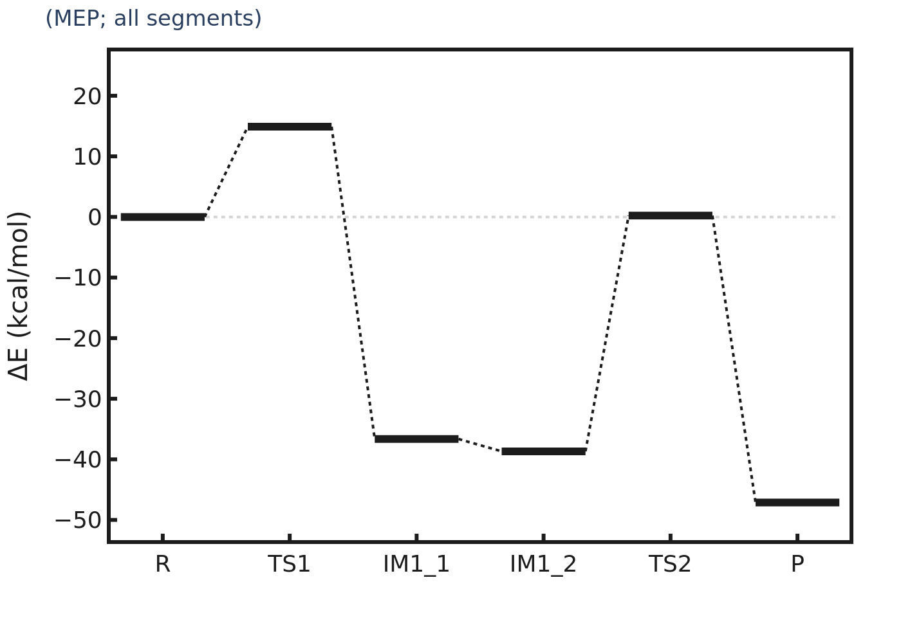
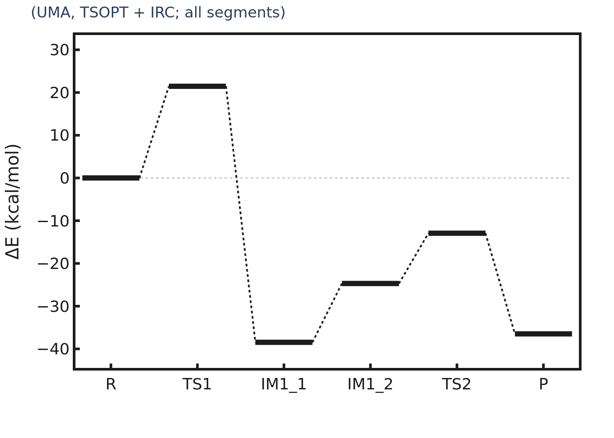
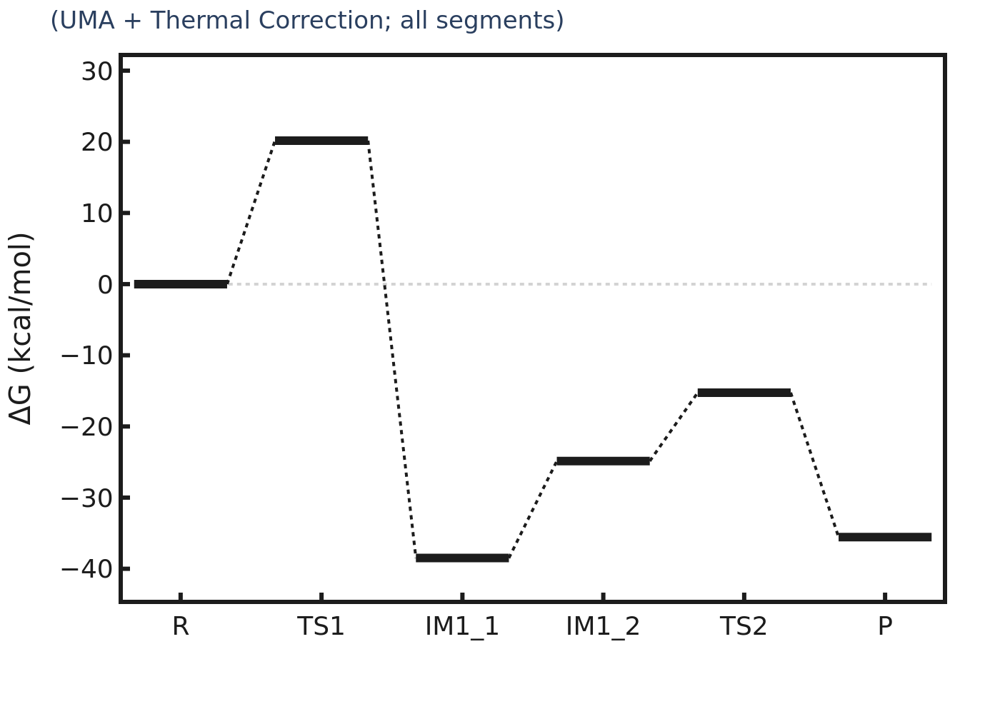
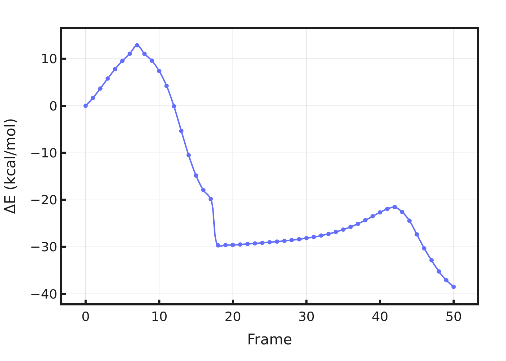

# チュートリアル

実例ベースで学びたい場合は、このページを参照してください。

## 推奨順序

1. {ref}`bezA 酵素反応ケーススタディ <ja-tutorial-case-study>`
2. {ref}`Smoke test マトリクス <ja-tutorial-smoke-tests>`

```{important}
TS の出力は「候補」です。酵素反応では試行錯誤が普通であり（端点構造、ポケット定義、拘束、scan ターゲットの調整など）、`freq` と `irc` による検証を行ってください。
```

(ja-tutorial-case-study)=
## bezA 酵素反応ケーススタディ

この節では、bezA の実データを用いて `pdb2reaction all` の出力をどう読むかを整理します。

配布メモ: 同梱の `run.out` / `summary.yaml` に含まれる出力パスは、環境依存を避けるため `./bezA_case_study` へ正規化しています。

### この節で分かること

- 単一構造 + 段階的スキャンの設定の読み方
- `summary.log` / `summary.yaml` の要点確認方法
- TS「候補」と検証済みTSの区別
- 虚数振動数が複数残った場合の次アクション

### 同梱データ

- `../_static/bezA_case_study/r_input.pdb`
- `../_static/bezA_case_study/summary.log`
- `../_static/bezA_case_study/summary.yaml`
- `../_static/bezA_case_study/run.out`
- `../_static/bezA_case_study/ts_seg_01.pdb`
- `../_static/bezA_case_study/ts_seg_03.pdb`
- `../_static/bezA_case_study/energy_diagram_MEP.png`
- `../_static/bezA_case_study/energy_diagram_UMA_all.png`
- `../_static/bezA_case_study/energy_diagram_G_UMA_all.png`
- `../_static/bezA_case_study/irc_plot_all.png`

### アーカイブ実行コマンド（参照）

```bash
pdb2reaction -i r.pdb -c 'SAM,GPP,MG' --ligand-charge 'SAM:1,GPP:-3' \
  --scan-lists '[ ("CS1 SAM 320","GPP 321 C7",1.60) ]' \
               '[ ("GPP`321/H11","GLU`186/OE2",0.90) ]' \
  --tsopt True --thermo True --out-dir bezA_case_study
```

同梱アセットでは、この初期構造を `r_input.pdb` として配置しています。

パイプラインモードは `path-search`（再帰精密化あり）です。

### このリポジトリから再現実行する

リポジトリルートで次を実行します:

```bash
pdb2reaction -i docs/_static/bezA_case_study/r_input.pdb \
  -c 'SAM,GPP,MG' --ligand-charge 'SAM:1,GPP:-3' \
  --scan-lists '[ ("CS1 SAM 320","GPP 321 C7",1.60) ]' \
               '[ ("GPP`321/H11","GLU`186/OE2",0.90) ]' \
  --tsopt True --thermo True --out-dir ./bezA_case_study
```

注: このコマンドはカレントディレクトリに `./bezA_case_study/` を作成します。`docs/_static/bezA_case_study/` は配布用アセットであり、そこに出力されるわけではありません。

このコマンドで、同梱初期構造を使ってケーススタディと同種のワークフローを再実行できます。

### 主な結果

`summary.log` より:

```text
Number of MEP images : 29
Number of segments   : 3
```

MEP 状態の相対エネルギー（kcal/mol）:
- `TS1`: `+14.90`
- `IM1_1`: `-36.65`
- `IM1_2`: `-38.68`
- `TS2`: `+0.21`
- `P`: `-47.13`

セグメント別 TS チェック:
- Segment 01: `n_imag = 2`（最大虚数 `-205.1 cm^-1`）
- Segment 03: `n_imag = 3`（最大虚数 `-1067.2 cm^-1`）

解釈: ワークフローは完走し候補構造は得られていますが、最終的なTS確定には追加の最適化と検証が必要です。

### 図

#### 全体 MEP



#### UMA エネルギー（全セグメント）



#### UMA Gibbs（全セグメント）



#### IRC 全体図



### 読み解きポイント

#### 進んでいる点

- MEP、TSOPT、IRC、熱化学まで出力されています。
- Segment 01/03 で化学的に意味のある結合変化が検出されています。
- `summary.log` と `summary.yaml` のエネルギー要約は整合しています。

#### 追加調整が必要な点

- `n_imag > 1` なので、現状のTS構造は検証済みTSではありません。
- 現段階では「有力なTS候補」として扱ってください。

### TS 検証チェックリスト（必須）

1. 各TS候補で虚数振動数が1本であること（`freq`）。
2. その虚数モードが意図した反応座標に沿うこと。
3. IRC を両方向に流し、端点が意図した極小に落ちること。
4. 端点構造の結合関係が想定する R/P と一致すること。

関連ページ:
- [tsopt](tsopt.md)
- [freq](freq.md)
- [irc](irc.md)
- [path-search](path_search.md)

### よく行う次の調整

1. `--opt-mode heavy` で TS 最適化を再試行する。
2. `--flatten-imag-mode True` を有効化する。
3. 難しいセグメントで `--max-nodes` を増やす。
4. scan ターゲットや初期構造を見直す。

### 次

- 続き: {ref}`Smoke test マトリクス <ja-tutorial-smoke-tests>`
- セットアップとCLIの基本は [はじめに](getting-started.md) を参照してください。

(ja-tutorial-smoke-tests)=
## Smoke test マトリクス

この節では `test/run.sh` の各ケースを目的別に整理します。

本節では「何を確認するケースか」が先に分かるように整理しています。内部ラベル番号を知らなくても選べる構成です。

### 場所

- スクリプト: `test/run.sh`
- 開発者向けメモ: `test/test.md`
- 入力サンプル: `test/*.pdb`, `test/*.xyz`, `test/*.gjf`

リポジトリルートから実行:

```bash
bash test/run.sh
```

### 目的別マトリクス

#### 入力形式と基本パイプライン確認

- PDB 全体フロー + TS/熱化学確認
  - `pdb2reaction -i r.pdb p.pdb -q -1 --tsopt True --thermo True`
- XYZ 形式確認
  - `pdb2reaction -i r.xyz p.xyz -q -1`
- GJF メタデータ確認
  - `pdb2reaction -i r.gjf p.gjf ...`

#### 単一入力 + 段階スキャン入口

- PDB スキャン入口
- GJF スキャン入口
- XYZ スキャン入口

セレクタ解釈と staged scan の挙動確認に使います。

#### TS フロー確認

- PDB で TS+熱化学
- PDB で `light` TS 最適化
- GJF テンプレートから TS

多構造MEPを組まずに TS 挙動を確認したい場合に有効です。

#### サブコマンド単体確認

- `dft` CPU 確認
- `freq` 確認
- `tsopt` 確認

`all` 全体よりも局所的な切り分けに向いています。

### 複雑系カバレッジ

- `run.sh` 後半の複雑系ブロックでは、複雑ポケット、scan2d/scan3d、DMF、TSOPTモード差分を確認します。
- ベースライン確認後の重め回帰として使ってください。

### 推奨順序

1. ベースライン形式確認（PDB/XYZ/GJF の二構造ケース）。
2. 段階スキャン入口ケースと `scan/stage_*` 出力確認。
3. TS フロー確認ケース。
4. 最後に複雑系ブロック。

### まず見る出力

- `<run_name>.out`
- `<run_name>/summary.log`
- `<run_name>/summary.yaml`
- `<run_name>/path_search/mep_plot.png`
- `<run_name>/path_search/post_seg_*/`

### 位置づけ

- `test/test.md`: 開発者向けの最小メモ。
- 本節: 利用者向けのケース選択ガイド。

## 関連ページ

- [はじめに](getting-started.md)
- [トラブルシューティング](troubleshooting.md)
- [概念とワークフロー](concepts.md)
